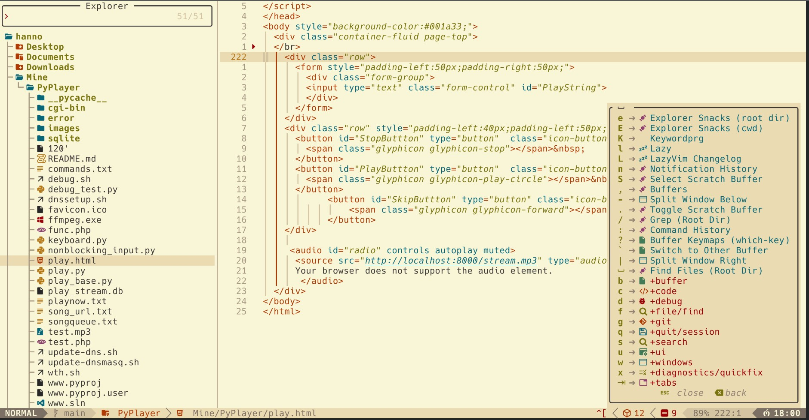

Lazyvim Configuration backup
All settings for Lazyvim | dotnet debugging | gruvbox theme | lsp c++



```
sudo apt-get install grep
sudo apt-get install ripgrep
```

Installing Lsp

Requirements
```
sudo apt-get install python3
sudo apt-get install unzip
sudo apt-get install pipx
pipx ensurepath
```
C++ LSP ( use :Mason to add clangd | clang-format | cpptools)
```
pipx install cpplint
```


**Some Notes I am saving here about git**

to get your local changes onto GitHub, with minimal fuss, go with:
✅ Option 2: Rebase (cleaner history)

#git pull --rebase
#git push

This:

    Re-applies your local commits on top of the remote commits.

    Keeps history linear (no merge clutter).

    Safely preserves both your work and what's on GitHub.

If for some reason you get conflicts, Git will pause during rebase and ask you to resolve them. After resolving:

#git rebase --continue
#git push

Alternatively, if you just want to override remote (and don’t care about the 6 remote commits):

    ⚠️ This will wipe the 6 commits on GitHub and replace them with your local state:

#git push --force

But I recommend --rebase unless you're intentionally overwriting history.

✅ Options to Fix
🟡 Option 1: Discard local conflict and keep the version from HEAD (your branch)

git checkout --ours -- Controllers/User.cs

